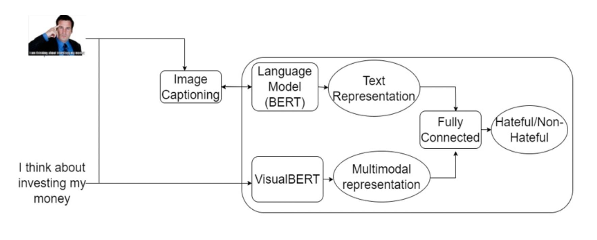

# Detecting hate in multimodal memes

Facebook's [Hateful Memes Challenge](https://ai.meta.com/blog/hateful-memes-challenge-and-data-set/)

## Objective:
Every day, millions of memes are created on so- cial media platforms and some individuals abuse it by creating offensive memes to disparage particular individuals or groups. 

Therefore, in order to stop the spread of hate, it is crucial to identify hate memes. To categorize these memes, one needs to have a working understanding of both the meme’s visual and linguistic components.

## Dataset:
Hateful Meme Classification Dataset provided by Facebook.

There are 11,040 total memes, each labeled as 1 or 0 which corresponds to hateful or benign class respectively. The train set contains 36% hateful memes and 64% non-hateful memes, while the validation set and test set are balanced. 

## Method:


Textual representation of meme is generated from BERT using image captioning and Multimodal representation is generated from VisualBERT using meme image and meme text. Both these representations are concatenated and sent to a MLP to classify it as hate meme or non-hate meme.

## Code:
1. Create a new virtual environment.
2. Clone this repository

```
conda create --name HateMeme python=3
conda activate HateMeme 
git clone https://github.com/Shanthi17/HateMeme_Classification.git
pip install -r requirements.txt
python -m pip install 'git+https://github.com/facebookresearch/detectron2.git@v0.5'
```
3. `Training_and_inference.ipynb` - Contains code for training and inferencing.


## Results:
| Model | AUROC | Accuracy | 
| --- | --- | --- | 
| Baseline Model - VisualBERT | 71.41 | 64.73 | 
| Top performing ensemble model | 84.5 | 73.2 | 
| Our Model | 74.3 | 69 | 

